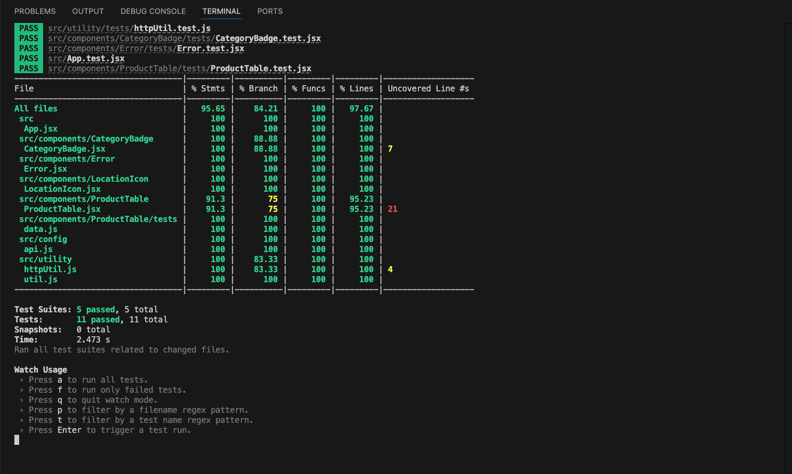
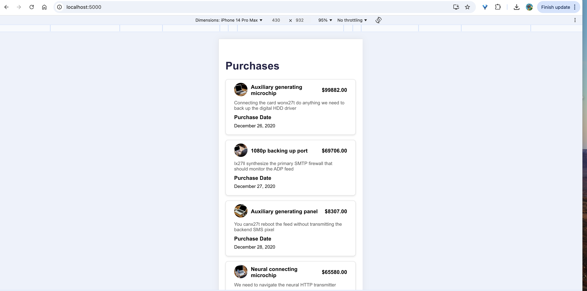
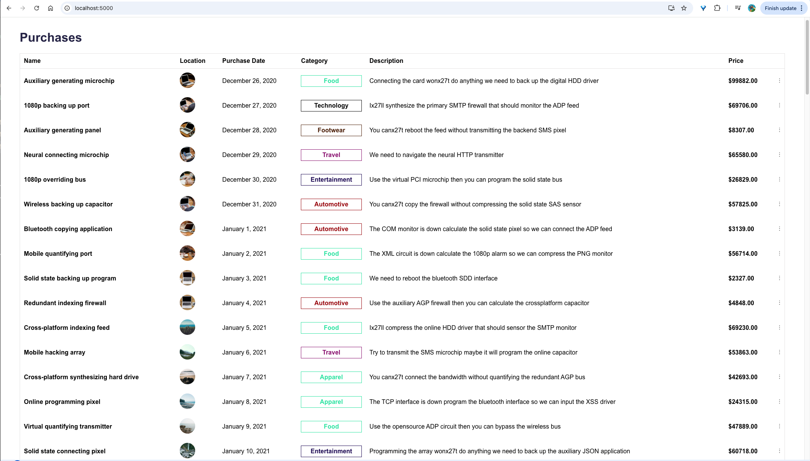

# Purpose of this project

This project was developed for ID.ME coding assignment

- Libraries used
- React 18.3.1
- Plain CSS
- JavaScript (ES6 & latest)
- Jest and React Testing Library for unit testing.

## Completed task

- Responsive UI (mWeb & Desktop)
- Unit tests
- Documentation this file

## Prerequisite to stat and test the app

It can be tested in Mac / Linux or Windows
Node.js must be installed in the Machine, any node.js version ideally should work, development was done in Node.js v20.17.0

## How to start the app

In the project directory, run the following commands:

#### `npm install`

#### `npm start`

Runs the app in the development mode.\
Open [http://localhost:5000](http://localhost:5000) to view it in a we browser e.g. - Google Chrome

## How to run test cases and code coverage

#### `npm test`

#### `npm test:coverage`

##### Code Coverage

## Application screenshots

#### Mobile View

#### Desktop View

## How to build the app

#### `npm run build`

Builds the app for production to the `build` folder.

## Few performance improvements notes (different approaches)

- Current implementation renders both Mobile Web and Desktop and CSS media query hides the inappropriate version of UI. Example if the app is opened in Desktop browser it will hide the Mobile Web version and vice-versa. Instead it can be implemented in other way next point.
- There are many JavaScript / React libraries which can detect the device mobile/Tablet/Desktop browser based on the device detected the required React component can be rendered, instead of rendering both the UI and hiding using CSS media query.
- There can be infinite scrolling enabled or pagination enabled for better application performance.
